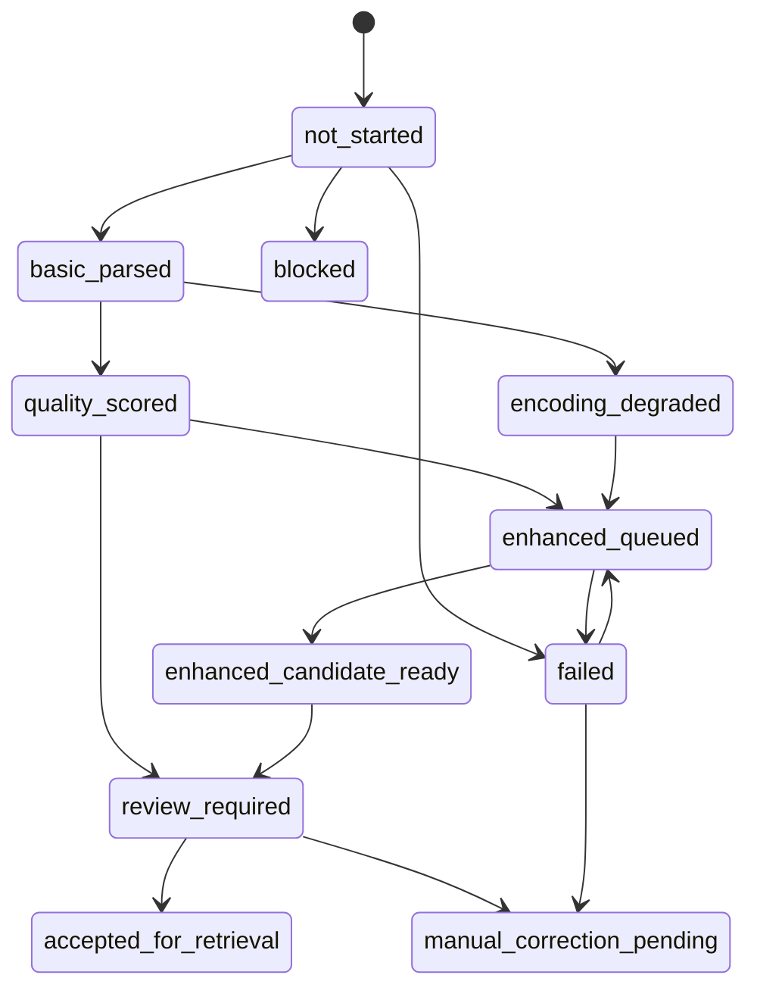

# 可扩展资料解析架构（Phase 2C）

本页说明数学一与 408 大规模资料库的页面级解析路线。它是系统架构，不是学科笔记，也不代表已经安装 MinerU、Docling、OCR 或云端服务。

## 为什么不能全部使用同一个解析器

数字原生、排版简单的页面使用 PyMuPDF 更快、更稳定，也容易追溯；公式密集页、特殊字体页、矩阵和上下标页可能需要视觉或公式模型。让重型模型处理全部资料会显著增加时间、显存、磁盘和误识别风险。系统因此先生成基础结果，再按页评分，只把异常页送入增强队列。

手动修正只用于极少数自动方法都失败的页面。任何 LaTeX 即使能够渲染，也不能自动证明数学含义正确。

## 三种解析档案

| 档案 | 适用资料 | 默认策略 |
| --- | --- | --- |
| `math1_formula_dense` | 高数、线代、概率论中的公式密集教材和题目 | 对公式、矩阵、分式、上下标和字体异常敏感，优先进入增强候选 |
| `cs408_general` | 操作系统、网络、普通数据结构与组成原理文字页 | 正常正文保留 PyMuPDF，公式、表格、布局异常进入审核或增强 |
| `cs408_symbol_dense` | 补码、位号、地址字段、数组下标等符号密集页 | 一个替换字符即可进入增强队列，保留代码标识符和数字 |

档案定义在 `config/parsing-profiles.yaml`。档案只决定候选路线，不自动接受内容，也不生成正式知识笔记。

## 解析器接口

所有适配器统一返回 parser_id、parser_version、parser_mode、page_number、text、formula_candidates、image_candidates、layout_warnings、extraction_metrics、review_status 和 output_relative_path。

- `basic_pymupdf`：基础文字层解析器，只读处理页面。
- `paddleocr_vl_local`：当前主增强解析器；只接收本地页面 PNG，以 GPU 单页运行，输出机器检查候选。
- `enhanced_mineru_standard`：保留的本地对照解析器；不再作为自动路由首选。
- `enhanced_docling_formula`：接口占位，当前调用会明确返回未安装。
- `optional_mathpix_formula_crop`：未来可选云端裁剪兜底，默认禁用网络；必须另行明确授权。

增强适配器不能覆盖基础结果。解析器输出必须带 source_id 和原始页码，页面图像仍保留来源关系。

## 基础结果、增强候选和已接受结果

未来新来源采用以下逻辑目录；本阶段不创建空目录、不迁移当前来源：

```text
vault/90-Parsed-Sources/<source_id>/
├─ basic/
├─ enhanced/
│  ├─ mineru/
│  ├─ paddleocr-vl/
│  └─ docling/
├─ annotations/
│  ├─ formula-corrections.md
│  └─ manual-review.md
├─ quality/
│  ├─ page-quality.json
│  ├─ routing-decisions.json
│  └─ comparison-report.md
└─ accepted/
   ├─ pages/
   │  └─ page-XXXX.md
   └─ retrieval-ready.md
```

`basic/` 保存基础事实快照；`enhanced/` 只保存不同解析器的候选；`annotations/` 保存人工注释而不改写旧结果；`quality/` 保存指标和路由理由；`accepted/` 只能在明确审核或未来经过批准的受控规则下生成。页级检索读取 `accepted/pages/`，`retrieval-ready.md` 作为人工导航。正式知识笔记仍位于其他编号目录。

当前已解析来源保留 Phase 2B 的扁平目录，标记为 `phase2b_legacy_flat_read_only`。其路由计划只保存在本地 `review-queue/parsing-routing/`，不会进入 Git，也没有移动、重写或重新解析现有页面。未来迁移必须设计单独的复制、校验和回滚流程，本阶段不执行。

Phase 2D-0 在这层架构之上增加元数据批次规划。它读取 manifest、质量路由、资源限制和队列状态，将页面分为基础候选、未来增强、人工审核、资源推迟、已在队列和不支持六类。规划结果不等于执行授权，也不会改变页面状态。操作说明见 [[00-系统维护/Batch-Parsing-Guide|大规模资料批次规划指南]]。

## 页面质量与路线

质量评分同时检查替换字符数量/比例、上下标风险、公式密度、矩阵或分式风险、代码密度、低文本密度、纯图片页、表格、多栏、阅读顺序和字体编码。总字符数只是一个指标。

| 路线 | 含义 |
| --- | --- |
| `basic_accepted_candidate` | 基础结果正常，但仍需受控接受才能用于检索 |
| `review_required` | 轻微公式、图片、表格或布局异常，先人工查看 |
| `enhanced_parse_queued` | 替换字符、公式、上下标或字体异常，未来只重跑该页 |
| `manual_or_optional_cloud_review` | 基础解析失败、格式不支持或风险过高；人工优先，云端必须另行授权 |

路由只产生候选和队列，不自动把资料放入正式知识区。

## 状态机与追溯



每次状态变化记录来源、页码、时间、解析器和原因。失败重试限定为单页；已通过检查的页作为断点跳过。旧事件和旧候选不得被修改来掩盖错误。

## 资源和队列

`config/resource-limits.yaml` 针对 16GB 内存和 RTX 4060 Laptop 8GB 显存设置：默认并发 1、单次最多 25 页、单页超时 180 秒、内存预算 10GB、显存预算约 6.5GB、单页最多重试 2 次。重型解析器只处理异常页，禁止并发批量重跑。

模型缓存必须使用项目内相对目录 `models/cache`；队列和断点位于 `review-queue/`。运行队列与断点不进入 Git，路由决定不含正文，可以审核和比较。

## 何时人工修正

只有增强候选仍无法还原符号、公式语义无法确认或阅读顺序需要原页判断时，才建立人工修正注释。修正必须引用 source_id、原始页码、页面预览和修改理由；不能直接编辑基础结果或增强候选。

## 当前本地增强接入

PaddleOCR-VL 1.6 已按上述边界接入：依赖锁定在独立项目环境，模型缓存和关键文件哈希位于项目内配置。自动路由首选它，并把结果写入被忽略的 `enhanced/paddleocr-vl/page-XXXX/`。机器检查通过只表示候选结构可用；固定抽样与异常页仍进入复核，任何页面都不会自动成为 accepted。MinerU 4.0.0 保留在独立环境中供对照，不覆盖其已有候选。具体命令见 [[00-系统维护/Enhanced-Parsing-Guide|本地公式增强解析指南]]。

入口：[[学习主页|首页]] · [[00-系统维护/PDF-Parsing-Guide|PDF 解析指南]] · [[00-系统维护/Validation-Guide|验证说明]]
